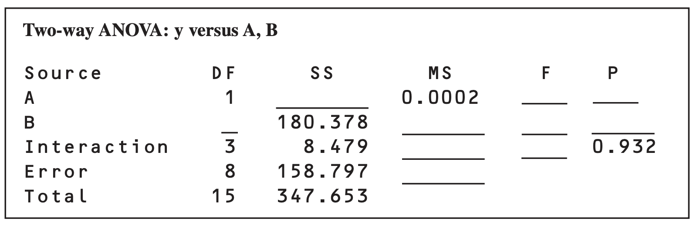

```{r setup, include=FALSE}
knitr::opts_chunk$set(echo = TRUE)
```

### 1 The following output was obtained from a computer program that performed a two-factor ANOVA on a factorial experiment. 


a) Fill in the blanks in the ANOVA table.

b) How many levels were used for factor B?

c) How many replicates of the experiment were performed?
