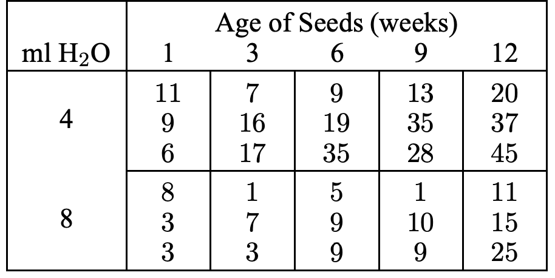
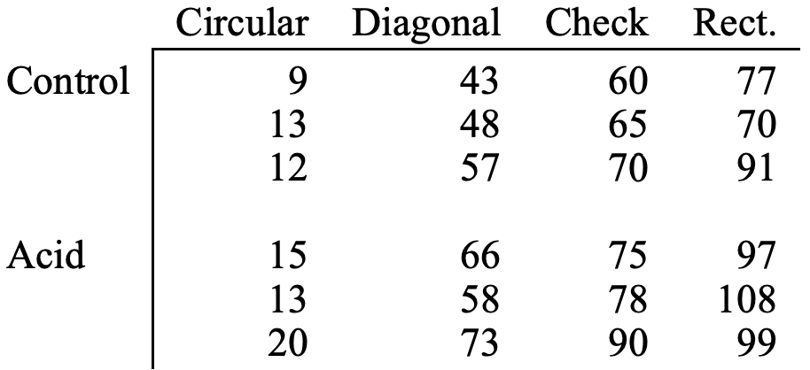
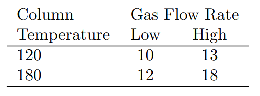

```{r setup, include=FALSE}
knitr::opts_chunk$set(echo = TRUE)
```


### 1 The following output was obtained from a computer program that performed a two-factor ANOVA on a factorial experiment.    
```{r, echo=FALSE, results='asis'}
table <- '
|    Source   | DF |    SS   |   MS   | F |   P   |
|:-----------:|:--:|:-------:|:------:|:-:|:-----:|
|      A      |  1 |    -    | 0.0002 | - |   -   |
|      B      |  - | 180.378 |    -   | - |   -   |
| Interaction |  3 |  8.479  |    -   | - | 0.932 |
|    Error    |  8 | 158.797 |    -   |   |       |
|    Total    | 15 | 347.653 |        |   |       |
'
cat(table)
```


a) Fill in the blanks in the ANOVA table.
```{r}
# calculating missing p-values

# P(F > 0.00001), df1 from the A factor, df2 from the Error
pf(q = 0.00001, df1 = 1, df2 = 8, lower.tail = F)

# P(F > 3.02917), df1 from the B factor, df2 from the Error
pf(q = 3.02917, df1 = 3, df2 = 8, lower.tail = F)
```

```{r, echo=FALSE, results='asis'}
table <- '
|    Source   | DF |    SS   |   MS   |    F    |      P     |
|:-----------:|:--:|:-------:|:------:|:-------:|:----------:|
|      A      |  1 |  0.0002 | 0.0002 | 0.00001 |  0.9975543 |
|      B      |  3 | 180.378 | 60.126 | 3.02917 | 0.09334106 |
| Interaction |  3 |  8.479  |  2.826 | 0.14237 |    0.932   |
|    Error    |  8 | 158.797 | 19.849 |         |            |
|    Total    | 15 | 347.653 |        |         |            |
'
cat(table)
```


b) How many levels were used for factor B?    
$4$ levels because DF from B treatment is $b - 1 = 3$, so $b = 4$.   

c) How many replicates of the experiment were performed?        
Degrees of freedom from Error is $ab(r - 1) = 8$, then $2 \times 4 \times (r - 1) = 8$, then $8r = 16$, then $r = 2$ replicates.   

### 2 Brewer’s malt is produced from germinating barley, so brewers like to know under what conditions they should germinate their barley. The following is part of an experiment on barley germination. Barley seeds were divided into 30 lots of 100 seeds, and each lot of 100 seeds was germinated under one of ten conditions chosen at random. The conditions are the ten combinations of weeks after harvest (1, 3, 6, 9, or 12 weeks) and the amount of water used in germination (4 ml or 8 ml). The response is the number of seeds germinating. We are interested in whether the timing and/or amount of water affect germination. Analyze these data to determine how the germination rate depends on the treatments.    

```{r}
df <- expand.grid(h20 = c(4, 8), age_seeds = c(1, 3, 6, 9, 12))
df <- rbind(df, df, df)  # 3 reps
df <- df[order(df$h20), ]
rownames(df) <- 1:nrow(df)  # fix row numbers
df$h20 <- as.factor(df$h20)
df$age_seeds <- as.factor(df$age_seeds)

# assign response
df$seeds <- c(
  11, 7, 9, 13, 20,
  9, 16, 19, 35, 37,
  6, 17, 35, 28, 45,
  8, 1, 5, 1, 11,
  3, 7, 9, 10, 15,
  3, 3, 9, 9, 25
)

tibble::glimpse(df)
```

```{r}
with(df, {interaction.plot(h20, age_seeds, seeds, type = 'b',
                           pch = c(1, 2, 3, 4, 5), leg.bty = 'o',
                           main = 'Interaction Plot of Age seeds and Amount of water',
                           xlab = 'Amount of water (ml)', ylab = 'Number of seeds',
                           trace.label = 'Age seed\n(weeks)')})
```
In all different harvesting weeks (1, 3, 6, 9, 12) we observe a decreasing of count of seeds when we increase the water amount of water (in ml) from 4 to 8, however, the count of seeds decreases a lot (from ~35 to ~20) when we change the amount of water from 4 to 8 ml and harvest after 12 weeks (losango symbol), whereas a smaller decrease is seen when we change the amount of water from 4 to 8 ml but harvest after only 1 week (circle symbol).    
When looking only to the Amount of water, using 4 mls rather than 8 always produced a larger number of seeds, despite the harvesting weeks.    
Let's check whether these factors and the interaction are significant.        
```{r}
fit <- aov(seeds ~ h20 * age_seeds, data = df)
summary(fit)
```

Using a significance level of $\alpha = 0.05$, we see that both the amount of water and harvesting weeks affect germination (i.e. are significant), however, the interaction between both treatments is not significant to the germination because $\text{p-value} = 0.4906 > \alpha$.

### 3 Pine oleoresin is obtained by tapping the trunks of pine trees. Tapping is done by cutting a hole in the bark and collecting the resin that oozes out. This experiment compares four shapes for the holes and the efficacy of acid treating the holes. Twenty-four pine trees are randomly selected from a plantation, and the 24 are assigned randomly to the eight combinations of whole shape (circular, diagonal slash, check, rectangular) and acid treatment (yes or no). The response is the total grams of resin collected from the hole (data from Low and Bin Mohd. Ali 1985). Analyze these data to determine how the treatments affect resin yield. Include the Tukey HSD test in your analysis.    

```{r}
# similar to the previous question
df <- expand.grid(acid = c('control', 'acid'), shape = c('circular', 'diagonal', 'check', 'rect'))
df <- rbind(df, df, df)
df$acid <- factor(df$acid, c('control', 'acid'))  # control level first
df$shape <- as.factor(df$shape)
df <- df[order(df$acid), ]
rownames(df) <- 1:nrow(df)
df$resin <- c(
  9, 43, 60, 77,
  13, 48, 65, 70,
  12, 57, 70, 91,
  15, 66, 75, 97,
  13, 58, 78, 108,
  20, 73, 90, 99
)
tibble::glimpse(df)
```

```{r}
with(df, {interaction.plot(acid, shape, resin, type = 'b',
                           pch = c(1, 2, 3, 4), leg.bty = 'o',
                           main = 'Interaction Plot of Control/Acid and Hole shape',
                           xlab = 'Treatment', ylab = 'Grams of resin',
                           trace.label = 'Hole shape')})
```
When looking only to the first treatment (control or acid), we can see that despite the hole shape the grams of resin are always bigger when using the control rather the acid treatment.    
In addition, the rate of grams of resin seems bigger when changing from control to acid treatment when using the rectangular shape hole rather the circular one, for example.    
The lines are quite parallel, which means that we would not expect an significant interaction.     

We can fit an two-way ANOVA first and check the results:   
```{r}
fit <- aov(resin ~ acid * shape, data = df)
summary(fit)
```
From this result, using a significance level of $\alpha = 0.05$, we can see that both control/acid treatment and hole shape treatments affect the quantity of grams of resin, i.e, they are significant. However, the interaction is not significant because the $\text{p-value} > 0.05$.         

```{r}
fit_tukey <- TukeyHSD(fit, ordered = F)
fit_tukey
```

From ANOVA, we saw that both treatments are significant (i.e. at least one treatment level differs from another). Now, with the Tukey HSD test, we can see that all the differences are significant as well (e.g., acid - control regarding the first treatment, and diagonal - circular and check - circular regarding the second treatment). In addition, ANOVA shows us the interaction was not significant, so we don't need to check it using a post hoc test such as Tukey HSD).   

### 4 Big sagebrush is often planted in range restoration projects. An experiment is performed to determine the effects of storage length and relative humidity on the viability of seeds. Sixty-three batches of 300 seeds each are randomly divided into 21 groups of three. These 21 groups each receive a different treatment, namely the combinations of storage length (0, 60, 120, 180, 240, 300, or 360 days) and storage relative humidity (0, 32, or 45%). After the storage time, the seeds are planted, and the response is the percentage of seeds that sprout. Use the data set HW3_Q4.xlsx and analyze these data for the effects of the factors on viability.    
```{r}
df <- expand.grid(rel_hum = c('0%', '32%', '45%'), storage_length = c(0, 60, 120, 180, 240, 300, 360))
df <- rbind(df, df, df)  # 3 reps
df$rel_hum <- as.factor(df$rel_hum)
df$storage_length <- as.factor(df$storage_length)
df <- df[order(df$rel_hum), ]
rownames(df) <- 1:nrow(df)
df$seeds_sprout <- c(
  82.1,	78.6,	79.8,	82.3,	81.7,	85,	82.7,
  79,	80.8,	79.1,	75.5,	80.1,	87.9,	84.6,
  81.9,	80.5,	78.2,	79.1,	81.1,	82.1,	81.7,
  83.1,	78.1,	80.4,	77.8,	83.8,	82,	81,
  80.5,	83.6,	81.8,	80.4,	83.7,	77.6,	78.9,
  82.4,	78.3,	83.8,	78.8,	81.5,	80.3,	83.1,
  83.1,	66.5,	52.9,	52.9,	52.2,	38.6,	25.2,
  78.9,	61.4,	58.9,	54.3,	51.9,	37.9,	25.8,
  81,	61.2,	59.3,	48.7, 48.8,	40.6,	21
)
tibble::glimpse(df)
```

```{r}
with(df, {interaction.plot(rel_hum, storage_length, seeds_sprout, type = 'b',
                           pch = c(1, 2, 3, 4, 5, 6, 7), leg.bty = 'o',
                           main = 'Interaction Plot of Relativity humidity and Storage length',
                           xlab = 'Relativity humidity (%)', ylab = 'Seeds that sprout (%)',
                           trace.label = 'Storage length\n(days)')})
```

From the interaction plot we can see that when changing the relativity humidity from 32% to 45% the percentage of seeds that sprout varies depending of the days of storage length, which seems to show there is an interaction.   
When changing the relativity humidity from 0% to 32% the percentage of seeds that sprout seems not to change that much when using different storage lengths. With very different slope lines across the last two levels of relativity humidity, we could suspect that there are interactions.    
```{r}
fit <- aov(seeds_sprout ~ rel_hum * storage_length, data = df)
summary(fit)
```

Using a significance level of $\alpha = 0.05$, we conclude that both treatments are significant. The interaction is also significant, as we suspected from the interaction plot.    

### 5 A researcher is interested in comparing the effect of 3 new herbicides and 2 different doses of nitrogen on soybean yield. Design the appropriate experiment with 2 replicates (paste the result below indicating the method/r code used for that).   
```{r}
set.seed(2023)
df <- expand.grid(herbicide = c('A', 'B', 'C'), nitrogen = as.factor(c(0, 100)))
df <- rbind(df, df)  # 2 reps
df <- df[sample(1:nrow(df)), ]  # randomly assign each treatment to an experimental unit
rownames(df) <- 1:nrow(df)  # fix row names
df
```


### 6 Create an interaction plot for the experiment measuring height in 2 cultivars of sorghum measured under 3 different fertilizers. Is there an interaction between the cultivar and fertilizer? The script below could be used to create the dataset in R:
```{r}
data <-data.frame(
  Fertilizer = as.factor(c(1, 2, 3, 1, 2, 3)),
  Cultivar = as.factor(c("A", "A", "A", "B", "B", "B")),
  height = c(1, 2, 3, 5, 4, 2)
)
data
```

```{r}
with(data, {interaction.plot(Fertilizer, Cultivar, height, type = 'b',
                             pch = c(1, 2), leg.bty = 'o',
                             main = 'Interaction Plot of Fertilizer and Cultivar',
                             xlab = 'Fertilizer', ylab = 'Height',
                             trace.label = 'Cultivar')})
```
Yes, there is an interaction between both treatments because the lines are crossing each other.   
The fertilizer 1 produces very low height for the cultivar A, but produces a higher height for the same fertilizer but using the another cultivar B.   
The opposite happens with the fertilizer 3: we see a higher height for the cultivar A than the cultivar B.    
This means that height seems to be affected by the combinations of the treatments (Fertilizer X Cultivar).   

### 7 Answer question 3 of chapter 3.        
### In an experiment to maximize the Y = resolution of a peak on a gas chromatograph, a significant interaction between A = column temperature and C = gas flow rate was found. The table below shows the mean resolution in each combination of column temperature and gas flow rate.    
   

a) Construct an interaction graph.    
```{r}
df <- data.frame(
  col_temp = as.factor(c(120, 120, 180, 180)),
  gas_flow_rate = factor(c('Low', 'High', 'Low', 'High'), levels = c('Low', 'High')),
  resolution = c(10, 13, 12, 18)
)
df
```
   
```{r}
with(df, {interaction.plot(col_temp, gas_flow_rate, resolution, type = 'b',
                           pch = c(1, 2), leg.bty = 'o',
                           main = 'Interaction Plot of Column Temperature and Gas Flow Rate',
                           xlab = 'Column Temperature', ylab = 'Resolution',
                           trace.label = 'Gas Flow Rate')})
```
   
   
b) Write a sentence, or two, to interpret this interaction.     
```{r}

```


